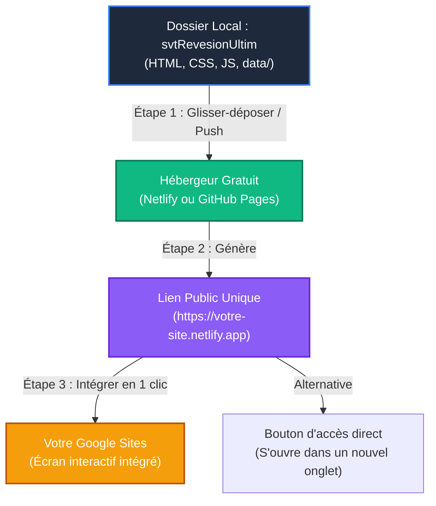

# Guide de Déploiement : SVT 2BAC sur Google Sites 🚀

Ce guide vous explique comment déployer votre plateforme de révision SVT 2BAC en ligne gratuitement et l'intégrer proprement dans votre site **Google Sites** (sites.google.com) pour vos élèves connectés à Internet.

---

## 💡 Pourquoi un hébergeur externe est nécessaire ?

**Google Sites** est un excellent outil de création de pages, mais il présente une limitation technique majeure :
* Il ne dispose pas d'un système de fichiers (FTP/Dossiers) pour téléverser votre dossier contenant vos sous-dossiers (`css/`, `js/`, `data/`).
* Si vous essayez d'importer le code HTML directement dans Google Sites via l'outil "Intégrer le code", les liens relatifs entre vos pages (comme `unite1.html` vers `index.html`) et vos scripts locaux ne fonctionneront pas.

### La solution moderne et professionnelle :
Nous allons héberger gratuitement votre dossier complet (`svtRevesionUltim`) sur un serveur d'hébergement statique ultra-rapide (comme **Netlify** ou **GitHub Pages**). Vous obtiendrez ainsi un lien public unique (ex: `https://svt-revision.netlify.app`), que vous pourrez ensuite **intégrer en un clic directement au cœur de votre Google Sites** !

---

## 🗺️ Schéma du flux de déploiement



---

## 🛠️ MÉTHODE A : Netlify (La plus simple, sans code, en 1 minute) 🌟

*Netlify est idéal si vous ne voulez pas utiliser Git ou le terminal. C'est un simple glisser-déposer.*

1. **Préparez votre dossier** : Assurez-vous que votre dossier local `svtRevesionUltim` contient bien tous vos fichiers (`index.html`, `unite1.html`, les dossiers `js/`, `css/`, `data/`, etc.).
2. **Allez sur Netlify Drop** : Ouvrez votre navigateur et accédez à **[app.netlify.com/drop](https://app.netlify.com/drop)**.
3. **Glissez-déposez** : Prenez votre dossier complet `svtRevesionUltim` depuis votre explorateur de fichiers et déposez-le dans la zone dédiée sur le site de Netlify.
4. **Patientez 10 secondes** : Netlify va analyser et déployer votre site immédiatement. Un lien public temporaire va apparaître (ex: `https://gorgeous-unicorn-12345.netlify.app`).
5. **Personnalisez l'adresse (Gratuit)** :
   * Créez un compte gratuit sur Netlify pour revendiquer ce site.
   * Allez dans **Site configuration** > **Site details** > **Change site name**.
   * Choisissez un nom propre pour vos élèves, par exemple : `svt-revision-2bac` (votre site sera accessible à `https://svt-revision-2bac.netlify.app`).

---

## 🛠️ MÉTHODE B : GitHub Pages (La méthode standard des développeurs) ⚙️

*Idéal si vous prévoyez de faire des mises à jour régulières de vos fichiers et voulez que le site en ligne se mette à jour automatiquement.*

1. **Créez un dépôt sur GitHub** : Connectez-vous à votre compte GitHub et créez un nouveau dépôt public nommé `svtRevesionUltim`.
2. **Initialisez Git dans votre dossier local** :
   Ouvrez votre terminal dans votre dossier local et exécutez :
   ```bash
   git init
   git add .
   git commit -m "Déploiement initial de la plateforme SVT"
   git branch -M main
   git remote add origin https://github.com/VOTRE_PSEUDO/svtRevesionUltim.git
   git push -u origin main
   ```
3. **Activez GitHub Pages** :
   * Sur GitHub, allez dans l'onglet **Settings** (Paramètres) de votre dépôt.
   * Dans la barre latérale gauche, cliquez sur **Pages**.
   * Sous la section **Build and deployment**, choisissez la source : **Deploy from a branch**.
   * Sous **Branch**, sélectionnez `main` et le dossier `/ (root)`, puis cliquez sur **Save** (Enregistrer).
4. **Accédez à votre site** : Après 1 à 2 minutes, votre plateforme sera disponible à l'adresse :  
   `https://VOTRE_PSEUDO.github.io/svtRevesionUltim/`

---

## 🎨 ÉTAPE FINALE : Intégration dans Google Sites

Une fois que vous avez votre lien public (provenant de Netlify ou de GitHub Pages), l'intégration dans Google Sites est un jeu d'enfant. Vous avez deux façons superbes de le présenter à vos élèves :

### Option 1 : L'intégration interactive (Le site vit dans Google Sites) 📲

Vos élèves pourront faire les QCM, lire les fiches et utiliser les flashcards directement sans quitter votre Google Sites !

1. Ouvrez l'éditeur de votre site sur **[sites.google.com](https://sites.google.com)**.
2. Allez sur la page où vous souhaitez afficher l'application.
3. Dans le panneau latéral droit, sous l'onglet **Insérer**, cliquez sur **Intégrer** (icône `< >`).
4. Dans la fenêtre qui s'ouvre, restez sur l'onglet **Par URL**.
5. **Collez le lien de votre site** (ex: `https://svt-revision-2bac.netlify.app`).
6. Google Sites va charger un aperçu de la plateforme. Cochez l'option **Page entière** (Whole page), puis cliquez sur **Insérer**.
7. **Ajustez la taille** : Étirez la boîte d'intégration en largeur et surtout en hauteur en tirant sur les poignées bleues pour éviter qu'il n'y ait une double barre de défilement inconfortable pour vos élèves.

> [!TIP]
> Donnez à la boîte d'intégration une hauteur généreuse (au moins **800px** à **1000px**) pour que l'interface "Bento Grid" et les quiz s'affichent parfaitement sur ordinateur et tablette sans couper le contenu !

---

### Option 2 : Le bouton d'accès direct (Idéal pour les smartphones) 📱

Certains élèves révisent sur leur téléphone. Ouvrir le site en plein écran en dehors de Google Sites offre une expérience encore plus fluide et immersive.

1. Dans le panneau latéral droit de Google Sites, faites défiler vers le bas et cliquez sur **Bouton**.
2. Nommez le bouton : `🚀 Lancer l'Application de Révision (SVT 2BAC)`
3. Dans le champ **Lien**, collez l'URL Netlify ou GitHub Pages.
4. Cliquez sur **Insérer** et placez le bouton au centre de votre page avec un joli titre accrocheur !

---

## ⚡ Conseils pour vos élèves avec une connexion limitée ou instable

Même si vous déployez le site en ligne pour les élèves connectés, **votre plateforme conserve tous ses superpouvoirs hors-ligne !**

> [!NOTE]
> **Le secret du LocalStorage**  
> Une fois que l'élève a chargé la page en ligne une première fois, les données de progression, d'erreurs et les bilans sont sauvegardés localement dans le navigateur de leur appareil via le `localStorage`. S'ils subissent des micro-coupures d'internet pendant qu'ils font un quiz, **le jeu ne plantera pas et continuera de fonctionner parfaitement** !

### Recommandation à partager avec vos élèves :
Ajoutez une petite note sur votre Google Sites :
> *« **Astuce Révision :** Si vous avez une connexion internet faible ou instable à la maison, chargez cette page une fois lorsque vous avez du réseau. Vous pourrez ensuite faire les quiz et réviser les fiches de cours même si votre connexion se coupe au milieu de vos révisions ! »*
